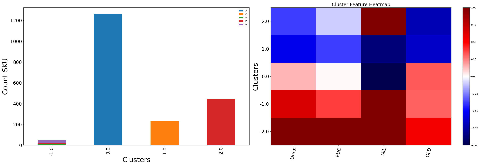
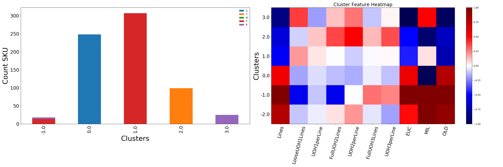
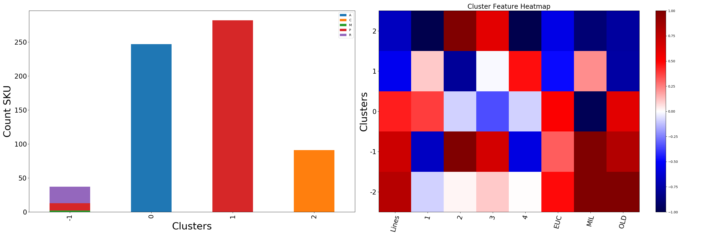
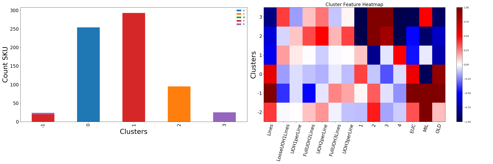
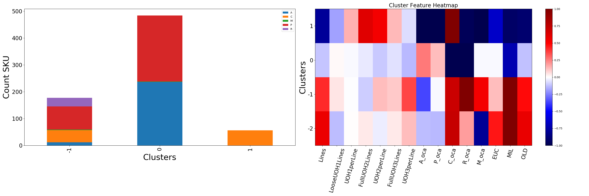
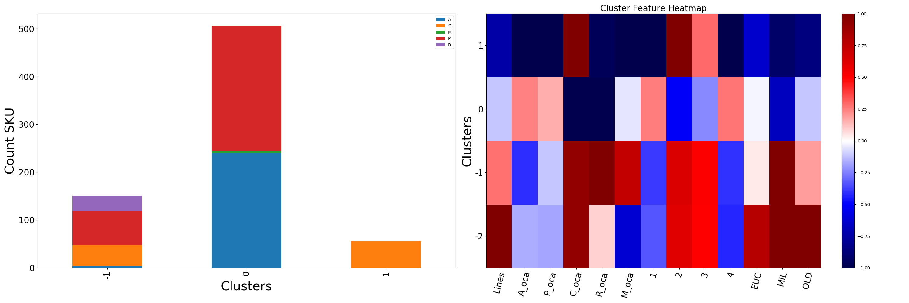

# Da Bom Text Output
## Type 1 Facility  Transformation Results 

Cluster 0.0 has 98% less MIL than average.  

Cluster 1.0 has 55% less Lines than average.  
Cluster 1.0 has 87% less MIL than average.  
Cluster 1.0 has 65% less OLD than average.  

Cluster 2.0 has 124% more MIL than average.  
Cluster 2.0 has 71% less OLD than average.  
## UOH Type 1 Facility  Transformation Results

Cluster 0.0 has 54% more Lines than average.  
Cluster 0.0 has 57% more EUC than average.  
Cluster 0.0 has 97% less MIL than average.  
Cluster 0.0 has 79% more OLD than average.  

Cluster 1.0 has 52% less Lines than average.  
Cluster 1.0 has 72% less OLD than average.  

Cluster 2.0 has 60% less Lines than average.  
Cluster 2.0 has 52% more UOH2perLine than average.  
Cluster 2.0 has 89% less MIL than average.  
Cluster 2.0 has 67% less OLD than average.  

Cluster 3.0 has 85% less Lines than average.  
Cluster 3.0 has 98% less EUC than average.  
Cluster 3.0 has 50% more MIL than average.  
Cluster 3.0 has 94% less OLD than average.  
## Seasonality Type 1 Facility  Transformation Results

Cluster 0 has 51% more EUC than average.  
Cluster 0 has 97% less MIL than average.  
Cluster 0 has 61% more OLD than average.  

Cluster 1 has 54% less Lines than average.  
Cluster 1 has 78% less 2 than average.  
Cluster 1 has 75% less OLD than average.  

Cluster 2 has 67% less Lines than average.  
Cluster 2 has 100% less 1 than average.  
Cluster 2 has 219% more 2 than average.  
Cluster 2 has 60% more 3 than average.  
Cluster 2 has 100% less 4 than average.  
Cluster 2 has 56% less EUC than average.  
Cluster 2 has 88% less MIL than average.  
Cluster 2 has 76% less OLD than average.  
## UOH Seasonality Type 1 Facility  Transformation Results

Cluster 0 has 60% more Lines than average.  
Cluster 0 has 56% more EUC than average.  
Cluster 0 has 96% less MIL than average.  
Cluster 0 has 91% more OLD than average.  

Cluster 1 has 54% less Lines than average.  
Cluster 1 has 81% less 2 than average.  
Cluster 1 has 50% more 4 than average.  
Cluster 1 has 73% less OLD than average.  

Cluster 2 has 59% less Lines than average.  
Cluster 2 has 50% more UOH2perLine than average.  
Cluster 2 has 100% less 1 than average.  
Cluster 2 has 198% more 2 than average.  
Cluster 2 has 86% more 3 than average.  
Cluster 2 has 100% less 4 than average.  
Cluster 2 has 91% less MIL than average.  
Cluster 2 has 66% less OLD than average.  

Cluster 3 has 85% less Lines than average.  
Cluster 3 has 100% less 1 than average.  
Cluster 3 has 164% more 2 than average.  
Cluster 3 has 129% more 3 than average.  
Cluster 3 has 100% less 4 than average.  
Cluster 3 has 98% less EUC than average.  
Cluster 3 has 50% more MIL than average.  
Cluster 3 has 94% less OLD than average.  
## UOH OCA Facility  Transformation Results

Cluster 0 has 99% less C_oca than average.  
Cluster 0 has 98% less R_oca than average.  
Cluster 0 has 71% less MIL than average.  

Cluster 1 has 78% less Lines than average.  
Cluster 1 has 62% more FullUOH2Lines than average.  
Cluster 1 has 53% more UOH2perLine than average.  
Cluster 1 has 100% less A_oca than average.  
Cluster 1 has 100% less P_oca than average.  
Cluster 1 has 579% more C_oca than average.  
Cluster 1 has 96% less R_oca than average.  
Cluster 1 has 100% less M_oca than average.  
Cluster 1 has 65% less EUC than average.  
Cluster 1 has 92% less MIL than average.  
Cluster 1 has 90% less OLD than average.  
## OCA Seasonality Facility  Transformation Results

Cluster 0 has 99% less C_oca than average.  
Cluster 0 has 98% less R_oca than average.  
Cluster 0 has 51% less 2 than average.  
Cluster 0 has 67% less MIL than average.  

Cluster 1 has 74% less Lines than average.  
Cluster 1 has 100% less A_oca than average.  
Cluster 1 has 100% less P_oca than average.  
Cluster 1 has 579% more C_oca than average.  
Cluster 1 has 96% less R_oca than average.  
Cluster 1 has 100% less M_oca than average.  
Cluster 1 has 100% less 1 than average.  
Cluster 1 has 244% more 2 than average.  
Cluster 1 has 100% less 4 than average.  
Cluster 1 has 63% less EUC than average.  
Cluster 1 has 92% less MIL than average.  
Cluster 1 has 85% less OLD than average.  
