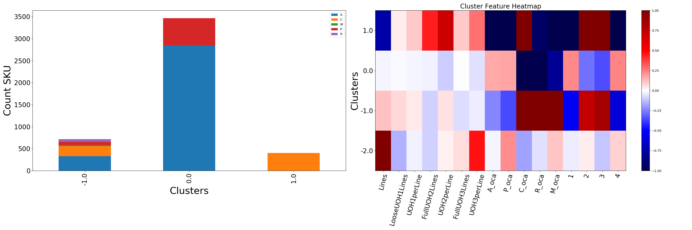
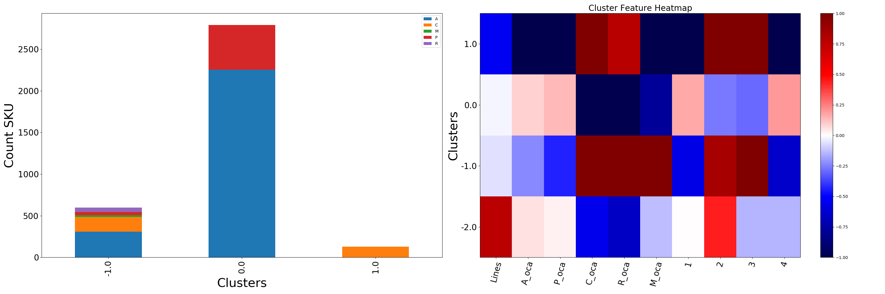
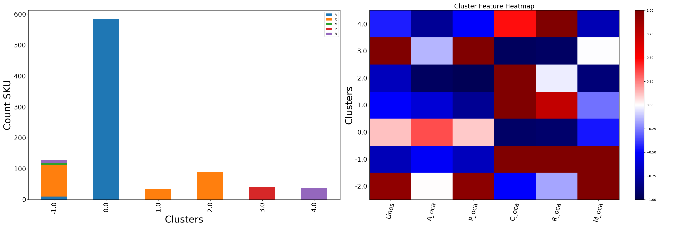
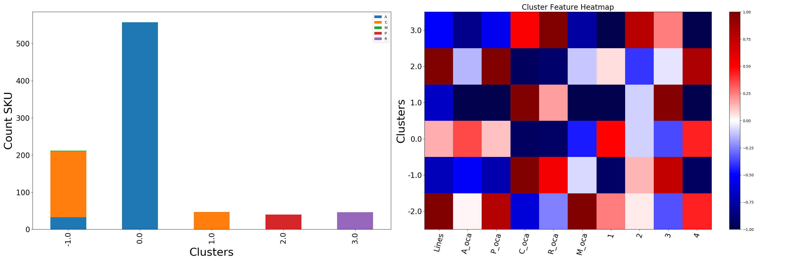
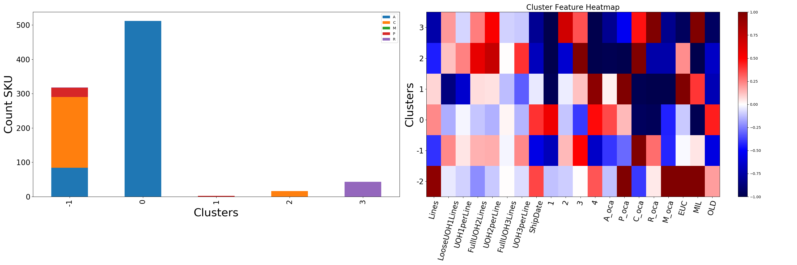
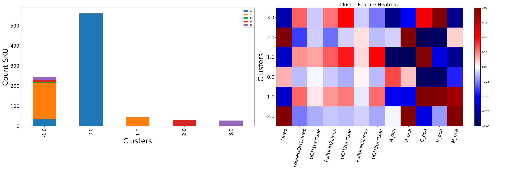

# Da Bom Text Output
   
  
   
## UOH OCA Seasonality  Transformation Results 

Cluster 0.0 has 99% less C_oca than average.   
Cluster 0.0 has 99% less R_oca than average.   
Cluster 0.0 has 80% less M_oca than average.   

Cluster 1.0 has 73% less Lines than average.   
Cluster 1.0 has 70% more UOH2perLine than average.   
Cluster 1.0 has 99% less A_oca than average.   
Cluster 1.0 has 100% less P_oca than average.   
Cluster 1.0 has 676% more C_oca than average.   
Cluster 1.0 has 93% less R_oca than average.   
Cluster 1.0 has 100% less M_oca than average.   
Cluster 1.0 has 100% less 1 than average.   
Cluster 1.0 has 108% more 2 than average.   
Cluster 1.0 has 158% more 3 than average.   
Cluster 1.0 has 100% less 4 than average.   
## OCA Seasonality  Transformation Results 

Cluster 0.0 has 99% less C_oca than average.   
Cluster 0.0 has 98% less R_oca than average.   
Cluster 0.0 has 78% less M_oca than average.   

Cluster 1.0 has 53% less Lines than average.   
Cluster 1.0 has 99% less A_oca than average.   
Cluster 1.0 has 99% less P_oca than average.   
Cluster 1.0 has 1212% more C_oca than average.   
Cluster 1.0 has 77% more R_oca than average.   
Cluster 1.0 has 100% less M_oca than average.   
Cluster 1.0 has 100% less 1 than average.   
Cluster 1.0 has 105% more 2 than average.   
Cluster 1.0 has 191% more 3 than average.   
Cluster 1.0 has 100% less 4 than average.   
## OCA Type 1  Transformation Results 

Cluster 0.0 has 92% less C_oca than average.   
Cluster 0.0 has 91% less R_oca than average.   

Cluster 1.0 has 50% less Lines than average.   
Cluster 1.0 has 61% less A_oca than average.   
Cluster 1.0 has 80% less P_oca than average.   
Cluster 1.0 has 218% more C_oca than average.   
Cluster 1.0 has 73% more R_oca than average.   

Cluster 2.0 has 68% less Lines than average.   
Cluster 2.0 has 94% less A_oca than average.   
Cluster 2.0 has 97% less P_oca than average.   
Cluster 2.0 has 350% more C_oca than average.   
Cluster 2.0 has 87% less M_oca than average.   

Cluster 3.0 has 202% more Lines than average.   
Cluster 3.0 has 313% more P_oca than average.   
Cluster 3.0 has 95% less C_oca than average.   
Cluster 3.0 has 93% less R_oca than average.   

Cluster 4.0 has 79% less A_oca than average.   
Cluster 4.0 has 50% less P_oca than average.   
Cluster 4.0 has 927% more R_oca than average.   
Cluster 4.0 has 70% less M_oca than average.   
## OCA Seasonality Type 1  Transformation Results 

Cluster 0.0 has 94% less C_oca than average.   
Cluster 0.0 has 93% less R_oca than average.   

Cluster 1.0 has 66% less Lines than average.   
Cluster 1.0 has 99% less A_oca than average.   
Cluster 1.0 has 100% less P_oca than average.   
Cluster 1.0 has 363% more C_oca than average.   
Cluster 1.0 has 100% less M_oca than average.   
Cluster 1.0 has 100% less 1 than average.   
Cluster 1.0 has 98% more 3 than average.   
Cluster 1.0 has 100% less 4 than average.   

Cluster 2.0 has 162% more Lines than average.   
Cluster 2.0 has 313% more P_oca than average.   
Cluster 2.0 has 94% less C_oca than average.   
Cluster 2.0 has 91% less R_oca than average.   
Cluster 2.0 has 83% more 4 than average.   

Cluster 3.0 has 50% less Lines than average.   
Cluster 3.0 has 82% less A_oca than average.   
Cluster 3.0 has 54% less P_oca than average.   
Cluster 3.0 has 51% more C_oca than average.   
Cluster 3.0 has 962% more R_oca than average.   
Cluster 3.0 has 76% less M_oca than average.   
Cluster 3.0 has 100% less 1 than average.   
Cluster 3.0 has 78% more 2 than average.   
Cluster 3.0 has 100% less 4 than average.   
## Total Features Weighted Transformation Results 

Cluster 0 has 55% more 1 than average.   
Cluster 0 has 95% less C_oca than average.   
Cluster 0 has 96% less R_oca than average.   
Cluster 0 has 98% less MIL than average.   

Cluster 1 has 85% less LooseUOH1Lines than average.   
Cluster 1 has 63% less UOH1perLine than average.   
Cluster 1 has 97% less 1 than average.   
Cluster 1 has 94% more 4 than average.   
Cluster 1 has 221% more P_oca than average.   
Cluster 1 has 97% less C_oca than average.   
Cluster 1 has 100% less R_oca than average.   
Cluster 1 has 100% less M_oca than average.   
Cluster 1 has 206% more EUC than average.   
Cluster 1 has 70% less OLD than average.   

Cluster 2 has 58% more FullUOH2Lines than average.   
Cluster 2 has 71% more UOH2perLine than average.   
Cluster 2 has 67% less ShipDate than average.   
Cluster 2 has 100% less 1 than average.   
Cluster 2 has 62% less 2 than average.   
Cluster 2 has 143% more 3 than average.   
Cluster 2 has 100% less 4 than average.   
Cluster 2 has 97% less A_oca than average.   
Cluster 2 has 99% less P_oca than average.   
Cluster 2 has 380% more C_oca than average.   
Cluster 2 has 73% less R_oca than average.   
Cluster 2 has 73% less M_oca than average.   
Cluster 2 has 100% less MIL than average.   
Cluster 2 has 65% less OLD than average.   

Cluster 3 has 73% less Lines than average.   
Cluster 3 has 52% more UOH2perLine than average.   
Cluster 3 has 79% less ShipDate than average.   
Cluster 3 has 100% less 1 than average.   
Cluster 3 has 68% more 2 than average.   
Cluster 3 has 100% less 4 than average.   
Cluster 3 has 81% less A_oca than average.   
Cluster 3 has 53% less P_oca than average.   
Cluster 3 has 962% more R_oca than average.   
Cluster 3 has 81% less M_oca than average.   
Cluster 3 has 95% less EUC than average.   
Cluster 3 has 333% more MIL than average.   
Cluster 3 has 94% less OLD than average.   
## UOH OCA Type 1  Transformation Results 

Cluster 0.0 has 94% less C_oca than average.   
Cluster 0.0 has 93% less R_oca than average.   

Cluster 1.0 has 65% less Lines than average.   
Cluster 1.0 has 50% more UOH3perLine than average.   
Cluster 1.0 has 94% less A_oca than average.   
Cluster 1.0 has 96% less P_oca than average.   
Cluster 1.0 has 362% more C_oca than average.   
Cluster 1.0 has 58% less R_oca than average.   
Cluster 1.0 has 80% less M_oca than average.   

Cluster 2.0 has 209% more Lines than average.   
Cluster 2.0 has 283% more P_oca than average.   
Cluster 2.0 has 96% less C_oca than average.   
Cluster 2.0 has 93% less R_oca than average.   

Cluster 3.0 has 73% less Lines than average.   
Cluster 3.0 has 84% less A_oca than average.   
Cluster 3.0 has 50% less P_oca than average.   
Cluster 3.0 has 54% more C_oca than average.   
Cluster 3.0 has 961% more R_oca than average.   
Cluster 3.0 has 81% less M_oca than average.   
